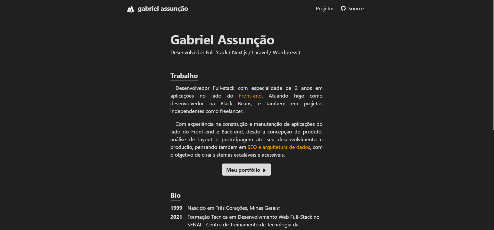

<!-- TITLE -->
<h1 align="center" color="black"><a href="https://portfolio-three-omega-71.vercel.app/" target="_blank">Portfólio</a></h1>

<!-- THUMB -->

  

<!-- STATUS -->

---

<!-- DESCRIPTION -->

 
        💡 
        Portfolio pessoal desenvolvido com SvelteKit e Typescript. Através de uma interface moderna e responsiva, apresento uma breve introdução sobre minha trajetória, bem como detalhes e links para projetos desenvolvidos.
    

<!-- INTRO -->

## Índice

-   [Tecnologias](#tecnologies)
-   [Objetivo](#goal)
-   [Funcionalidades](#features)
-   [Requerimentos de qualidade](#quality)
-   [Instruções de Uso](#glossary)
-   [Autor](#authors)

## Tecnologias 

- Sveltekit
- Typescript
- Sass
- AOS (Animações)

## Objetivo 

 A proposta é oferecer uma plataforma bem estruturada e visualmente atrativa, com o propósito de destacar habilidades e experiências de mercado.

## Funcionalidades 

- Requisição de repositorios - API

## Requerimentos de qualidade 

- Responsividade
- Performance
- Sustentável

## Instruções de Uso 

- Certifique-se de ter o Node.js instalado em seu sistema. Em seguida, execute o seguinte comando para instalar as dependências do projeto:

``
npm install
``

 

- Para iniciar o servidor de desenvolvimento local, utilize o seguinte comando:

``
npm run dev
``

O sistema estará disponível em http://localhost:5000/. As alterações no código serão recarregadas automaticamente no navegador durante o desenvolvimento.

 

- Para criar a versão final do projeto otimizada para produção, execute o seguinte comando:

``
npm run build
``

Os arquivos finais serão gerados na pasta 'build'.

 

- Após o processo de build, visualize a versão de produção localmente com o seguinte comando:

``
npm run preview
``

O sistema estará disponível em http://localhost:5000/ em uma versão otimizada para produção.

 

- O projeto utiliza ESLint para análise estática do código e Prettier para formatação. Verifique problemas de linting ou formate o código automaticamente com os seguintes comandos:

``
npm run lint
``

``
npm run format 
``

## Autor 

-   [@Gabriel Assunção](https://github.com/skGab) - Ideia e Construção.
