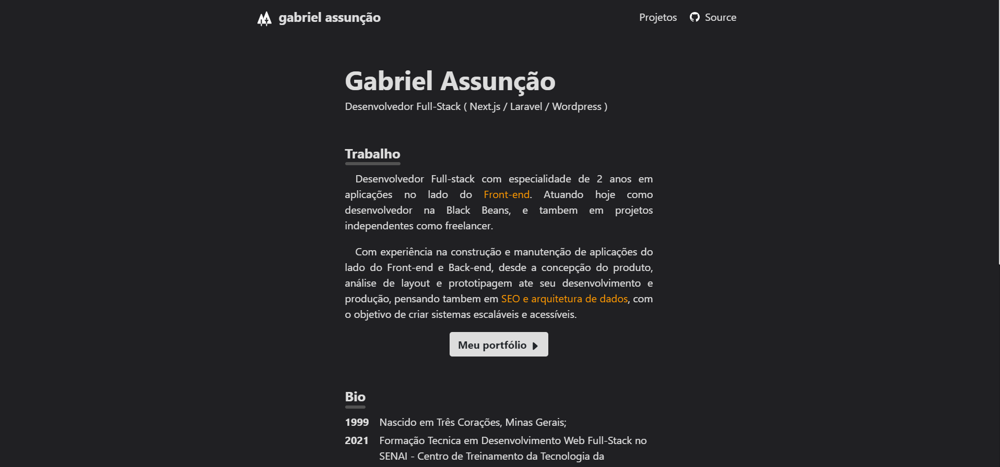

<!-- TITLE -->
<h1 align="center" color="black"><a href="https://portfolio-one-mu-37.vercel.app/" target="_blank">Portfólio</a></h1>

<!-- THUMB -->

  

<!-- STATUS -->

---

<!-- DESCRIPTION -->

 💡 Algumas linhas descrevendo o seu projeto.
    

<!-- INTRO -->

## Índice

-   [Tecnologias](#tecnologies)
-   [Introdução & O que o sistema deve fazer](#goal)
-   [Funcionalidades](#features)
-   [Requerimentos de qualidade](#quality)
-   [Instruções de Uso](#glossary)
-   [Autor](#authors)

## Tecnologias 

Defina o contexto e o escopo do seu projeto. O que está incluído e o que não está?

## Objetivo 

Escreva 1-2 parágrafos descrevendo o propósito e os objetivos do seu projeto.

## Funcionalidades 

Explique o processo de implantação e quaisquer observações adicionais para hospedar o sistema.

## Requerimentos de qualidade 

Liste os requisitos e critérios de qualidade que o sistema deve atender.

## Instruções de Uso 

Forneça definições e explicações para os termos-chave usados no projeto.

## Autor 

-   [@Gabriel Assunção](https://github.com/zDeep10) - Ideia e Construção
